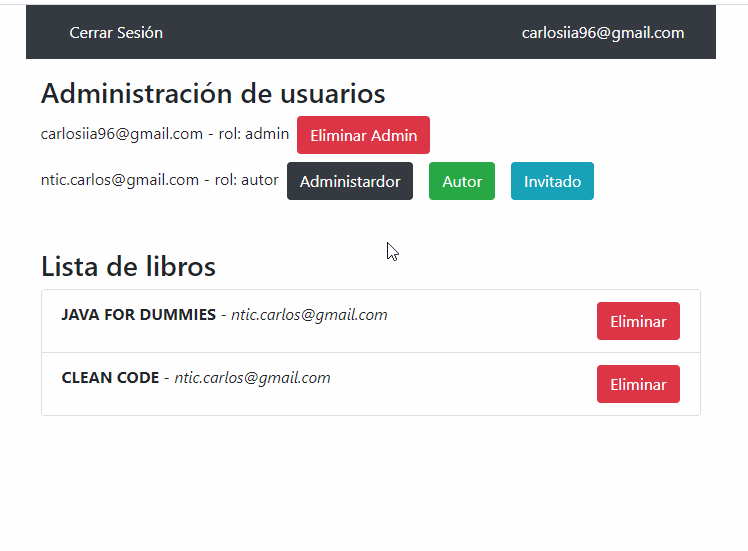
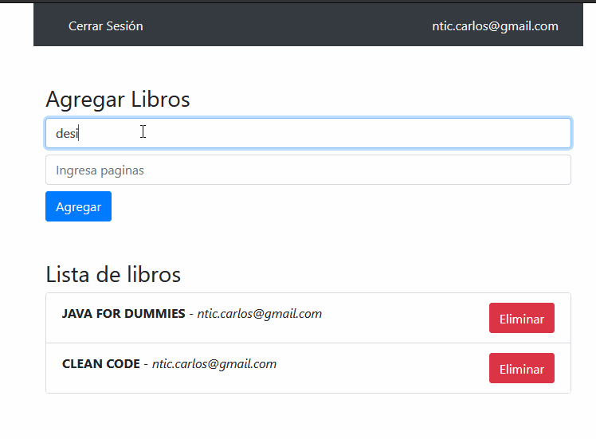

# Books app
[This app](https://books-custom-claims.netlify.app/) allow users to create custom claims(administrator, guest, author) through firebase functions.

## Administrator panel

## Author panel

## Dependencies
Node 8 - for firebase functions
